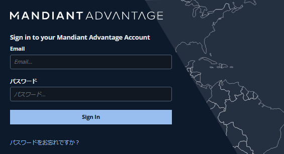
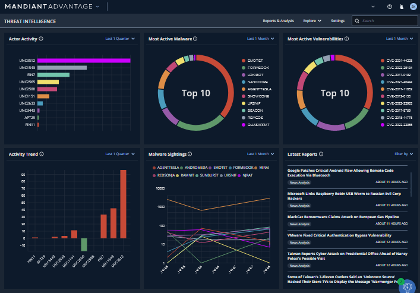
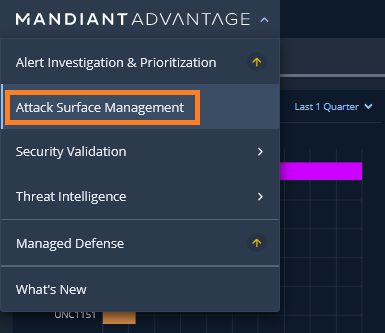
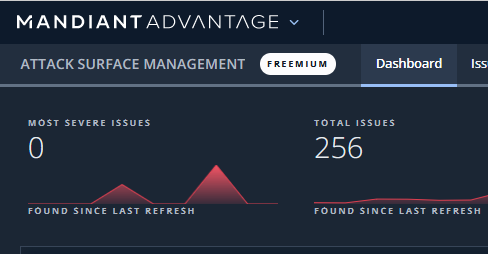

# 1. ASMへのアクセス

## Mandiant Advantage ポータルへの接続

---

１．ブラウザで  [https://advantage.mandiant.com/](https://advantage.mandiant.com/) にアクセスします

２．事前作成したアカウントでログインします

!!! Info
    このハンズオンは無償版アカウントの事前作成が必要です。アカウントを作成してない場合は [Mandiant Advantage 無償版登録ガイド]( https://www.mandiant.com/media/17411)  を参考に作成してください（登録内容の審査・確認に数日かかります）

３．ログインが成功すると下記画面が表示されます

## Attack Surface Management への移動

----

４．画面左上のスイッチャーをクリックし、`Attack Surface Management` をクリックします

５．画面左上の表示が Attack Surface Management となり、ASM画面に移動していることを確認します

６．このステップは終了です。[次のステップ](../02-configuration-check) に移動します
