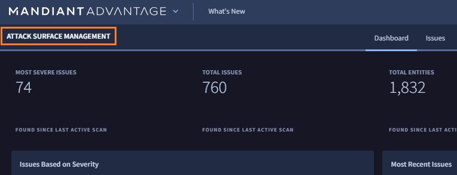

# 1. ASMへのアクセス

## Mandiant Advantage ポータルへの接続

---

１．ブラウザで  [https://advantage.mandiant.com/](https://advantage.mandiant.com/) にアクセスします

２．事前作成したアカウントでログインします

!!! Info
    このハンズオンは Mandiant Advantage アカウントが必要です。アカウントを作成してない場合は 、ハンズオン環境から事前に送信された招待メールを確認し、[登録ガイド](  https://seminar.mndt.work/ASM_Seminar_AccountGuide_202404.pdf) を参考に作成してください。（作成後、講師にお知らせください）

３．ログインが成功すると下記画面が表示されます

## Attack Surface Management への移動

----

４．画面左上のスイッチャーをクリックし、**Attack Surface Management** をクリックします

５．画面左上の表示が Attack Surface Management となり、ASM画面に移動していることを確認します

６．このステップは終了です。[次のステップ](../02-configuration-check) に移動します
