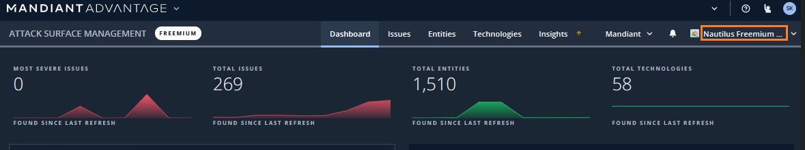
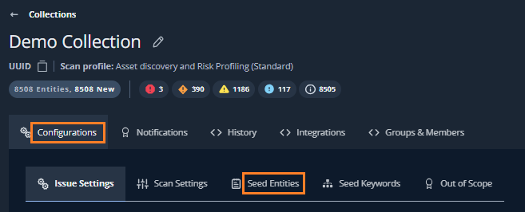

# 2. 設定の確認

このステップでは、事前に設定されている内容を確認します。

## プロジェクトへの確認と移動

このハンズオンでは２つのプロジェクトが用意されています。

1. フリー評価用プロジェクト：登録いただいたメールアドレスの組織名に関連する名称

2.  デモ用プロジェクト：SK-Workshop_Demo

画面右上のタブからプロジェクトの移動が可能です。まずフリー評価用プロジェクトを使ってLABを実施してください。

!!! check
    発見されたIT資産やリスクが少ない場合は、デモ用プロジェクトに移動して出力例を確認してください。

１．画面右上のプロジェクトタブを開きリストを確認します。その後、フリー評価用プロジェクト（自分の組織名に関連する名称のプロジェクト）をクリックします。

## Collection / Seed の確認

プロジェクトには ASM がアタックサーフェースの探索を行うための設定があらかじめ行われています。探索の起点となる Collection の Seed 設定を確認します。

２．画面上部の`Collections` タブから `Collection Settings` ボタンをクリックします。

３．事前登録されたCollectionをクリックします。

!!! check
    Collection の名前には、登録したメールアドレスのドメイン名（企業ドメイン名など）に関連した名称が設定されています。

!!! warning
    Collection の設定がない場合は主催者にお知らせください。Mandiant Advantage アカウント作成がセミナー開催間際になった場合、事前設定が行われていない場合があります。

４．`Configurations` タブの`Seed Entities`をクリックします。

５．事前設定された Seed を確認します。

## 探索履歴の確認

ASM が行った探索の履歴を確認します。この探索には事前設定された Seed の情報が利用されています。

６．`History` タブをクリックします。

７．探索履歴が表示されます。
少なくとも１つ以上の探索タスクが完了していることを確認します。

!!! check 
    タスクの完了は、Status が Finished になっていることで確認できます。その他にも、開始時間や探索時間、探索試行数などが表示があることを確認してください。

８．このステップは終了です。[<u>次のステップ</u>](../031-check-dashboard) に移動します。
