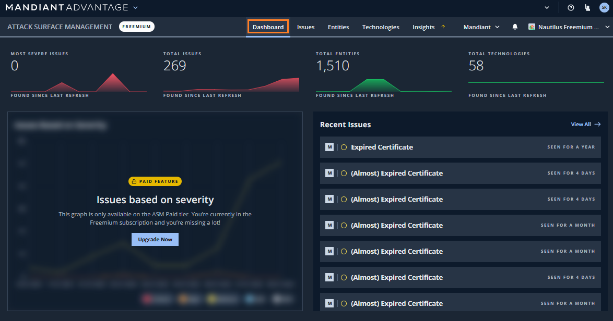
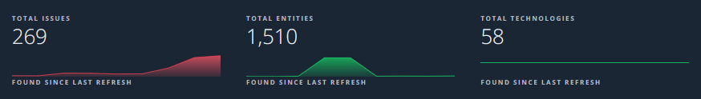
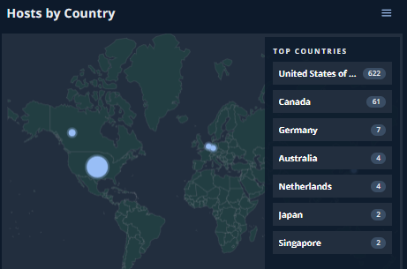
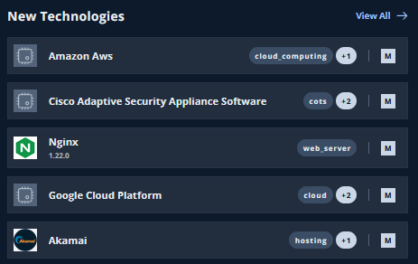
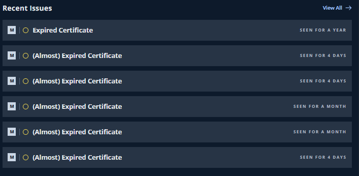

# 3. 探索結果の確認

このステップでは、ASMが行った探索の結果を確認します。

## DashBoard の確認

まずダッシュボードで概要を確認していきます。ここでは、探索で発見したアタックサーフェースの数や、時系列の変化や地理的な分布、最新の探索で発見した情報などが確認できます。

１．画面上部の`Dashboard` タブをクリックすると、下記画面が表示されます。

２．画面上部にある `Total Issues`、`Total Entities` 、`Total Technologies`の表示から、探索によって発見した Issue、Entity、Technologyの数を確認します。

３．画面下部にある `Hosts by Country` で、どの国でどの程度Entitiesが発見されているか確認します。国ごとのHost数が右側に表示されているので、海外拠点やグループ会社の状況と照らし合わせて確認してください。

!!! info
    国を選択するとEntitiesの画面に移動し、その国でフィルタされたEntitiesの一覧が表示されます。  
    このように、ダッシュボードの項目をクリックすることで、詳細の内容にドリルダウンすることができます。

４．`New Technologies`で、どのような Technologie が最近発見されたかを確認します。組織で利用禁止になっているサービスなどがないか、セキュリティポリシーと照らし合わせて確認してください。

５．最後に`Recent Issues`  で、どのようなリスクが最近発見されたを確認します。〇の色はリスクの重大度を示しています。内容とともに、赤や橙色の円がないか注意して確認してください。

!!! check
    気になる Entity や Issue を見つけた場合には、ブラウザの新しいタブを開くなどをしてメモをしておいてください。このハンズオンの後半で内容をチェックする自由時間を設けています。

６．以上で、アタックサーフェースの概要をダッシュボードで確認しました。  
次のステップからEntites、Technologies、Issueについて個別に確認していきます。
