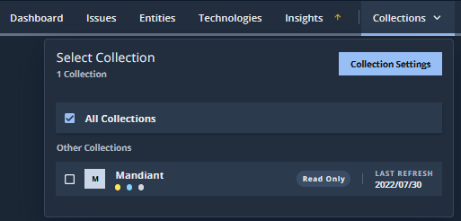
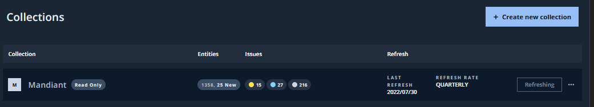
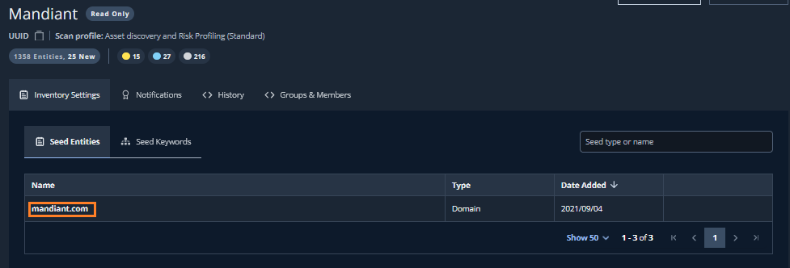
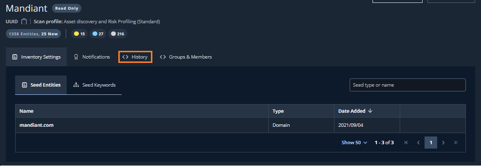
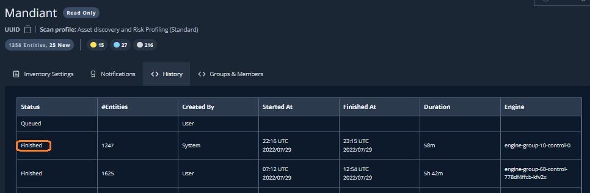

# 3. 探索結果の確認

このステップでは、ASMが行った探索の結果を確認していきます。

# 

## DashBoard の確認

無償体験版には ASM がアタックサーフェイスの探索を行うための設定があらかじめ行われています。探索の起点となる Collection の Seed 設定を確認します。

１．画面上部の`Collectoins` タブから、`Collection Settings` ボタンをクリックします認できます

２．事前登録されたCollectionをクリックします

!!! note
    Collection の名前には、登録したメールアドレスのドメイン名（企業ドメイン名など）に関連した名称が設定されています

３．事前設定された Seed を確認します

!!! note
    Seed の内容には、登録したメールアドレスのドメイン名（企業ドメイン名など）に関連するドメイン名等が設定されています

## 探索履歴の確認

ASM が行った探索の履歴を確認します。この探索には事前設定された Seed の情報が利用されています。

４．`History` タブをクリックします。

５．探索履歴が表示されます。少なくとも１つ以上の探索タスクが完了していることを確認します

!!! note
    タスクの完了は、Status が Finished になっていることで確認できます。その他にも、開始時間や探索時間、探索試行数などが確認できます
