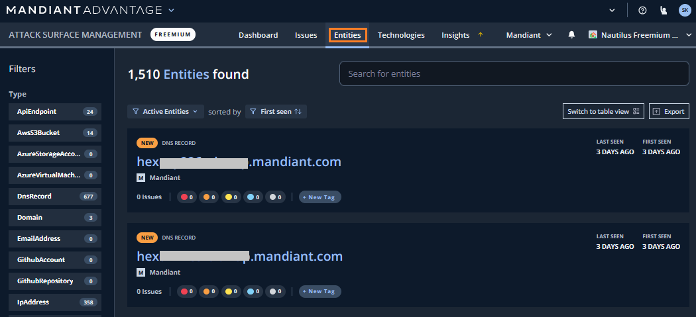
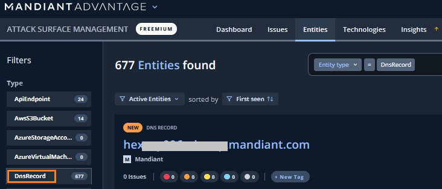
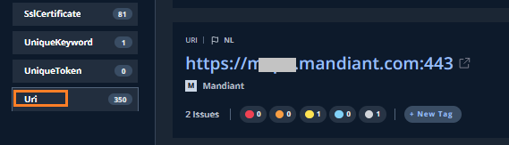
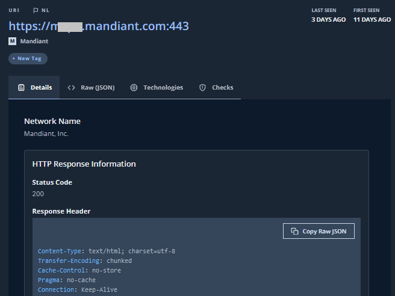
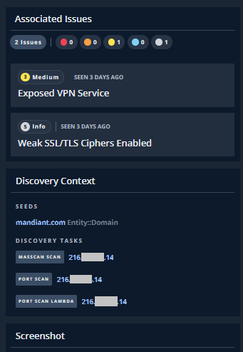
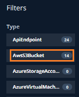
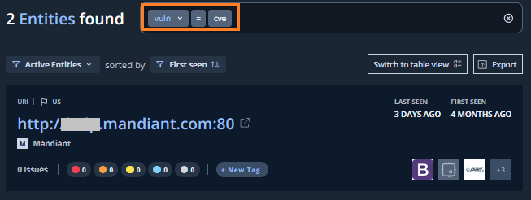
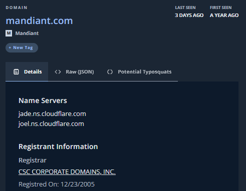
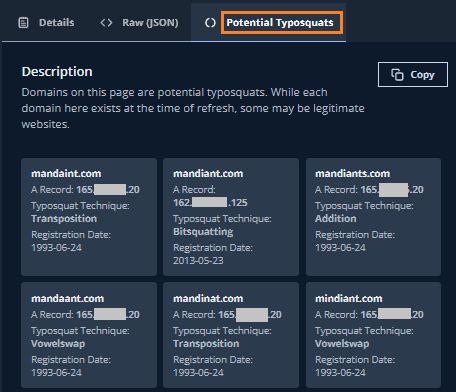

# 3. 探索結果の確認

## Entities の確認

続いて、ASMが発見した Entities (=外部露出しているデジタル・リソース）を確認します。

１．画面上部の`Entities` タブをクリックすると、下記画面が表示されます。

２．左ペインのFiltersを選択することで、表示するEntitiesをフィルタすることができます。**DNSRecord** を選択して、DNSレコードのみを表示します。自組織のドメインに関連するDNSレコードが表示されていることを確認してください。

３．左ペインのFiltersから、DNSRecordの選択を解除し、**URI** を選択します。自組織のドメインに関連するWebサイトのURLが表示されていることを確認してください。

!!! warning
    Filters で新しく条件を設定する時は、すでに選択している Filter をクリックし解除するのを忘れないでください。

４．URI の１つをクリックして詳細を確認します。探索で発見した時期の情報、このWebサイトについての応答コードやレスポンスの内容が確認できます。

!!! info
    Technologes タブで、この Entity に関連するTechnoloiesを確認できます(cpe形式) 。 またChecksタブでは、この Entity に対して実施した脆弱性チェックも確認できます。

５．画面右側では、このEntityに関連する Issues や探索の状況が確認できます。

!!! info
    無償体験版ではスクリーンショット機能は無効化されています。

!!! note
    ASMは、Seedで入力した情報をもとに探索を行っています。具体的には、ドメイン情報からDNSレコードの調査や、Webサイトの探索といった単純なものに加え、OSINTベースによる探索や、機械学習を用いた情報の紐づけなど、様々なロジックを用いています。探索の状況(Discovery Tasks)で表示されているのはその一部分です。

６．画面左上の ← Entities をクリックし、前の画面に戻ります。 
ASMはそのほかにも、攻撃者にとって興味の対象となるリソースについても探索を行っています。画面左の Filters の数字を確認し、 AWS S3バケットや GitHub などの Entities があれば内容を確認してみてください。 

　

６．画面右上の検索ウィンドウから、より詳細の検索を行うことができます。  
ここでは脆弱性があると推定される Entities を検索してみます。検索ウィンドウに`vul=`を入力し条件式に変換した後、`cve`と入力します。

!!! info
    検索ウィンドウは様々なクエリが実行できます。クエリの詳細は [ユーザガイド](https://docs.mandiant.com/home/attack-surface-management-search-syntax) でまとめられています。

７．最後に、Domain を確認します。左ペインのFiltersから **Domain** を選択し、特定のドメインを１つクリックして詳細を表示します。

８．**Potential Typosquats** タブをクリックします。このドメインについてタイポ・スクワッティング(Typo-Squatting)攻撃の可能性があるドメインが表示されます。

９．Entitiesの確認は以上です。次のステップで Technologies について確認していきます。
