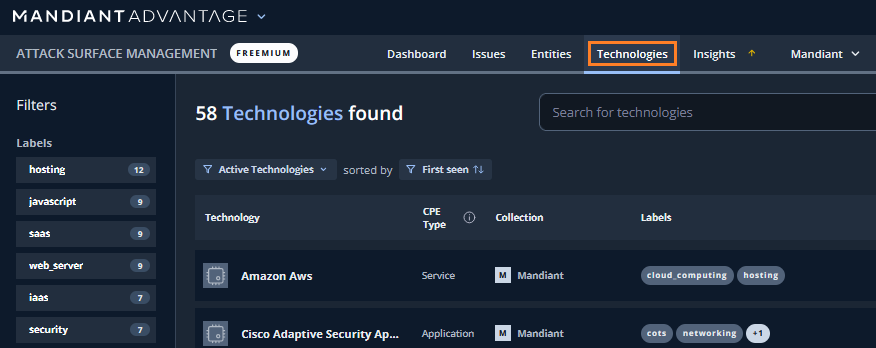
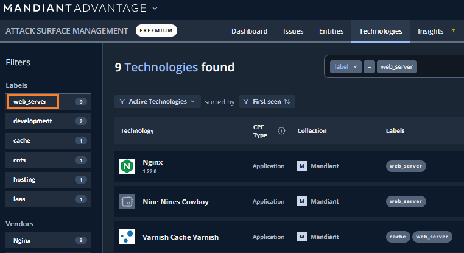
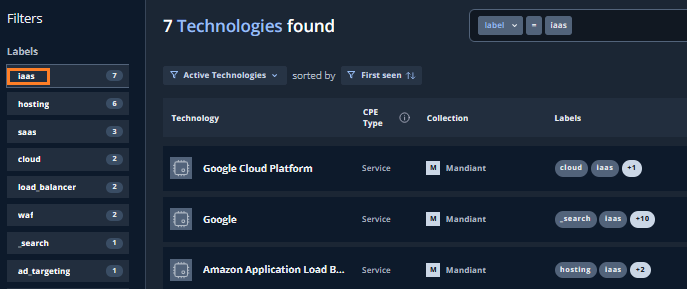
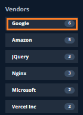

# 3. 探索結果の確認

## Technologies の確認

続いて、ASMが発見したTechnologies (=Entitiesで利用されているアプリケーションやサービス）を確認します。

１．画面上部の`Technologies` タブをクリックすると、下記画面が表示されます。

２．左ペインのFiltersを選択することで、表示するTechnologies をフィルタすることができます。**web_server**を選択して、Webアプリケーションに関連するテクノロジーを確認します。

３．Technologyを１つクリックすると、そのテクノロジーが利用さているEntitiesが確認できます。

４．Technologies 画面にもどり、左ペインのFiltersから、iaas を選択します。自組織で利用禁止になっているクラウドサービス等がないか、セキュリティポリシーと照らし合わせて確認してください。

５．左ペインのFiltersの下にある、Vendors の項目ではベンダー視点での確認ができます。各項目の数字を確認し、SaaSサービスやロードバランサーのベンダーなどの Technologies があれば内容を確認してみてください。

６．Technologies の確認は以上です。次のステップで Issues について確認していきます。
