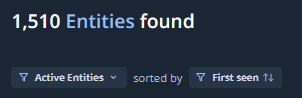

# 3. 探索結果の確認

## Technologies の確認

続いて、ASMが発見したTechnologies (=Entitiesで利用されているアプリケーションやサービス）を確認します。

１．画面上部の`Technologies` タブをクリックすると、下記画面が表示されます。

２．左ペインのFiltersを選択することで、表示するTechnologies をフィルタすることができます。**DNSRecordを**を選択して、

３．左ペインのFiltersを、DNSRecordの選択を解除し、URIを選択します。

４．URI の１つをクリックして、詳細を確認します。

スクリーンショットや

　

５．ASMはそのほかにも、攻撃者の興味をひきやすいリソースについても探索を行います。AWS S3バケットや GitHubの

もしあれば、

!!! note
 ASMは、Seedで入力した情報をもとに探索を行っています。
ここでは、ドメイン情報からDNSレコードの調査や、Webサイトの探索といった単純なものに加え、OSINTベースによる探索や、機械学習を用いた情報の紐づけなど、様々なロジックを用いて探索をおこなっています。。

６．画面右上のクエリウィンドウから、より詳細の検索を行うことができます

!!! note
 画面上部の Active Entities/ InActive Entities を変更することで、過去に発見したEntities を確認できます。InActive Entieysは「以前の探索で発見されたが、最新の探索では発見されなかった」ものとして

７．最後に、Domain をみます。

→

!!! note
　タイポ・スクワッティング(Typo-Squatting)攻撃の可能性があるドメインが表示されます。URLの打ち間違えを狙ったドメインとして

　
*Typo*-Squatting（タイポ・スクワッティング）

タイポすくわってぃんぐの 
画面上部の Active Entities/ InActive Entities を変更することで、過去に発見したEntities を確認できます。InActive Entieysは「以前の探索で発見されたが、最新の探索では発見さ

AWS のS3バケットや、Github関連のEntitiesなど、

タスクの完了は、Status が Finished になっていることで確認できます。その他にも、開始時間や探索時間、探索試行数などが確認できます

探索によって発見した Issue、Entity、Technologyの数を確認します。

３．Hosts by Country で、どの国でEntitiesが発見されているか、国ごとのHosts数を確認します。

４．New Technologiesで、

８．次のステップで、Technologies について確認していきます。
