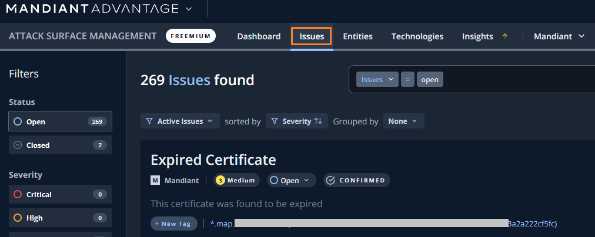

# 3.2. Issues の確認

## Issues の確認

続いて、ASMが発見したIssues (=セキュリティ視点から見た場合にリスクがある問題点）を確認します。

１．画面上部の`Issues` タブをクリックすると、下記画面が表示されます

２．左ペインの Filters を選択することで、表示するIssues をフィルタすることができます。Severity にある重大度を上から確認して、<u>数が０以上で重大度が一番大きいもの</u>を選択してください。

３．表示されたIssuesのうち１つをクリックして、詳細に移動します。

４．Issueの詳細情報を確認します。ここでは外部露出したVPNサービスが確認されています。このようなサービスは攻撃者から狙われやすいため、自社で認識されているものかどうかを確認していきます。

５．Proof タブをクリックすると、VPN機器と判断した根拠の情報が確認できます。

６．Affected Entity にあるURLをクリックすると、このIssueが存在するEntitiesを確認できます。

７．ここで少し時間をとって、どのようなIssueが発見されているか内容や種別を確認してみてください。

!!! check
    ASM が発見するIssue は露出したサービスの他に、露出した管理画面などの設定不備、パッチ未適用による脆弱性、開発中のシステムの露出など、様々なものがあります。

８．Issue の確認は以上です。次のステップに進んでください。
