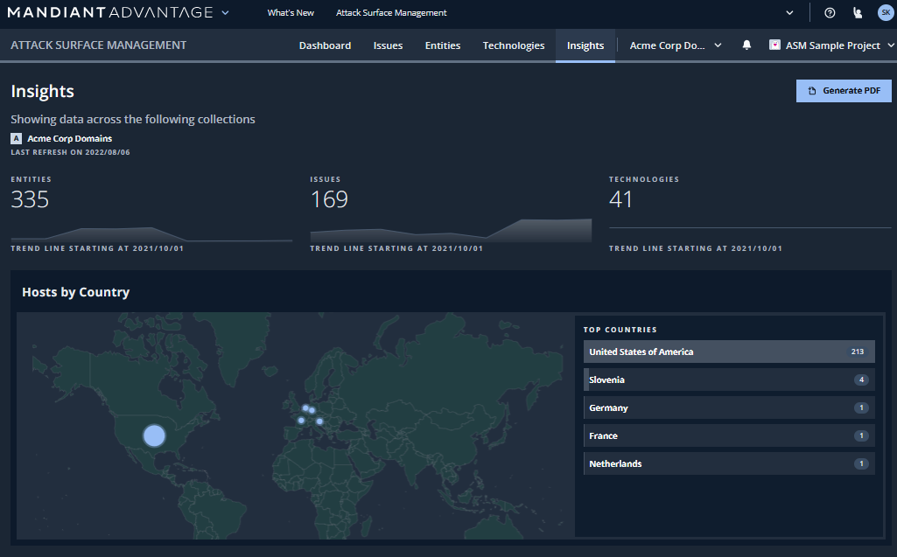
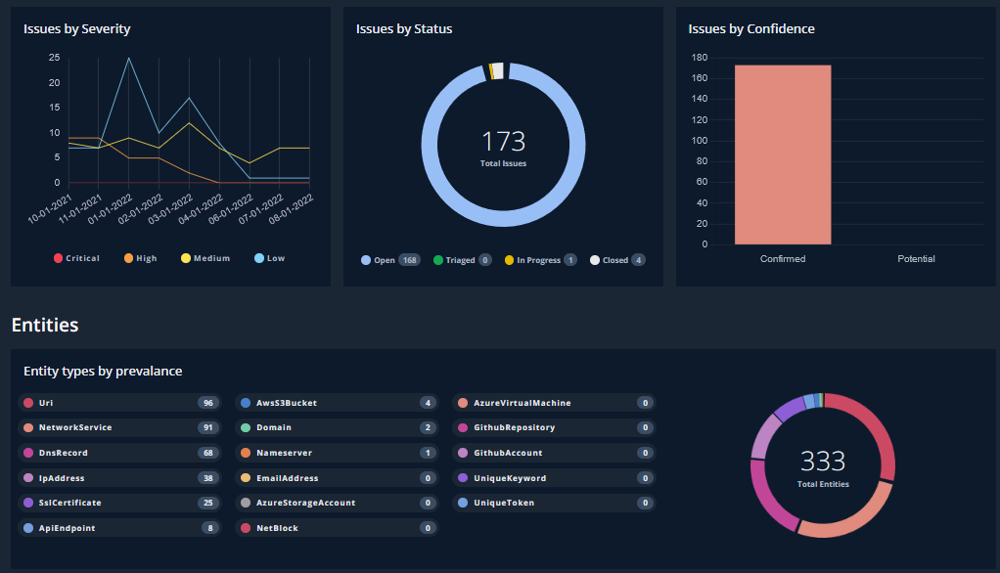
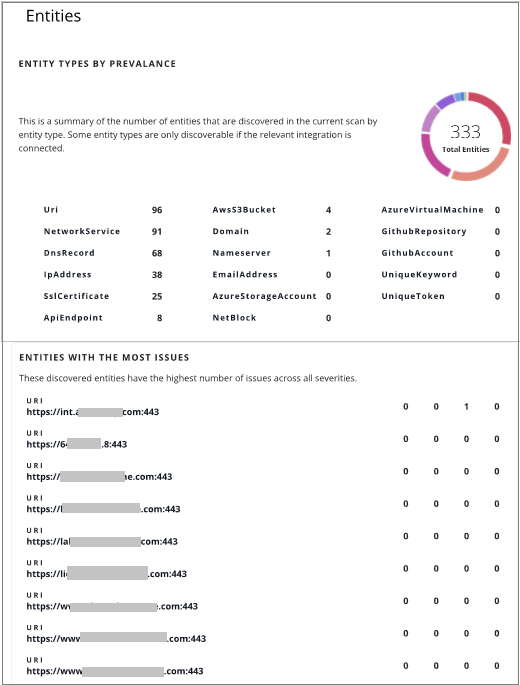

# 3. 探索結果の確認

## Insights の確認

!!! Info
    Insights は無償体験版では利用できないため機能の紹介を行います。画面の操作は行いません。

Insights 画面では、下記の情報などをまとめて確認することができます。

- PDF レポートの作成

- 重要度が高い Issue の Top10 

- Issue が多い Entites のリスト

- Issue タイプの傾向、Entities タイプの傾向

また、レポートとして下記のようなPDFを出力可能です。

ここまで、ASMが発見したアタックフェースを確認する場合の、基本的なウォークスルーを行いました。
