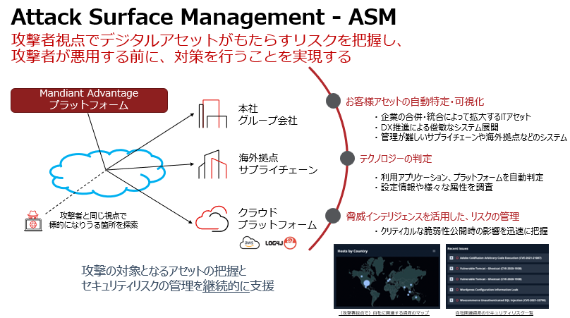

# Attack Surface Management ハンズオン

Mandiant Attack Surface Management (ASM) ハンズオンにようこそ！ 

本ハンズオンでは ASM の無償体験版を用いて、実際の画面を操作します。参加者の組織に関連するアタックサーフェース(攻撃対象領域)を確認することで、ASM の具体的な活用方法を体験いただきます。

## Mandiant ASM の機能

## ハンズオンの流れ

このハンズオンは５つのステップに分かれています。

- **ステップ１ - ASMへのアクセス**  
  Mandiant Advantage プラットフォームとASMへ接続します

- **ステップ２ - 設定の確認**  
  無償体験版に設定された内容を確認します

- **ステップ３ - 探索結果の確認**  
  ASMが探索した結果を確認し、アタックサーフェイスの情報、可視化されたリスクを把握します

- **ステップ４ - 応用編**  
  運用に役立つ機能や、動作の仕組みを確認します

- **ステップ５- まとめ** 

ステップ１～５の想定時間は、約40分です。

!!! warning
    このハンズオンで確認できるアタックサーフェースは、無償体験版の機能制限により一部の情報となります。この情報は ASM の活用方法の体験を目的としており、アタックサーフェースの情報提供自体を目的としたものではありませんのでご注意ください。
